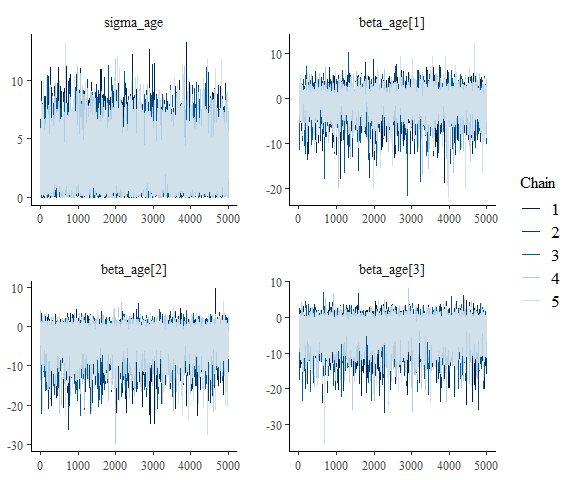
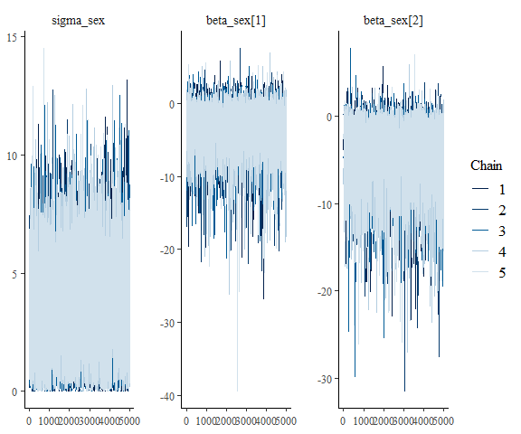
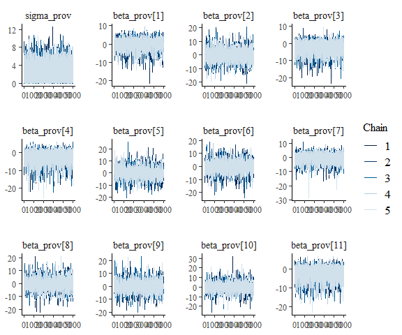
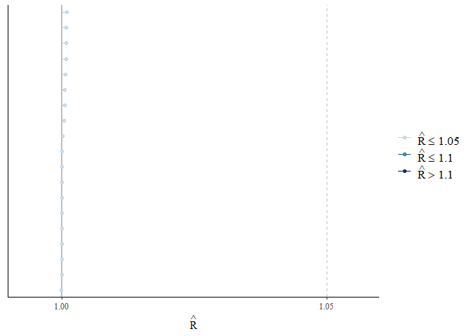
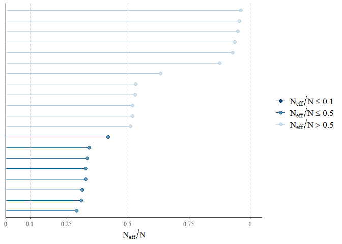

<!-- README.md is generated from README.Rmd. Please edit that file -->

# APPENDIX R-CODE

<!-- badges: start -->
<!-- badges: end -->

The goal of the Appendix of R-code is to provide interested readers in
more information about the Bayesian model and modeling code.

This document contains more information on the Bayesian estimation and
statistical analysis. The main analysis script (`main_script.R`)
contains the R-code that was used to load and restructure the data. The
Bayesian model as written in stan can be consulted in the
`stan_model.stan`-file.

## Bayesian methods

In this paper, our goal is to estimate the true underlying
seroprevalence of the population  ≥ 18 and  ≤ 65 years old as measured
every two weeks, *w* in Belgium, denoted *p*<sub>*w*</sub><sup>\*</sup>
(*w* = 1, …, *W* = 20).

We start by estimating the probability that each person in the
serosurvey is seropositive using a Bayesian logistic regression model
that accounts for the sensitivity and specificity of the ELISA assay,
each individual’s age, sex, and current province, iterated over each two
weeks they were sampled:

where *x*<sub>*i*</sub> is the result of the IgG ELISA (in primary
analyses) for the *i*th person (*i* = 1, …, *N*= 129) in the serosurvey.
The sensitivity, *θ*<sup>+</sup>, is determined using *n*<sup>+</sup>
RT-PCR positive controls from the lab validation study, of which
*x*<sup>+</sup> tested positive. The specificity, *θ*<sup>−</sup> , is
determined using *n*<sup>−</sup> pre-pandemic negative controls, of
which *x*<sup>−</sup> tested positive.

The probability of observing a diagnostic positive is a function of the
true positive rate and the false negative rate with regards to the true
underlying probability of seropositivity *p*<sub>*i*</sub> for that
person. This probability itself is a function of covariates **X**, which
consists of sex, age categories, and week of study, and their
coefficients **β**, and a random effect for household, *α*<sub>*h*</sub>
(*h* = 1, …, *H*= 129), with variance *σ*<sup>2</sup>. We used naive
priors on all parameters to allow for an exploration of the parameter
space. The priors on the sensitivity and specificity were flat from 0 to
1, equivalent to *U**n**i**f**o**r**m*(0, 1) or *B**e**t**a*(1, 1). We
used weak *N**o**r**m**a**l*(0, 3) priors for the logistic regression
coefficients **β**. The prior on the standard deviation of the household
effect, *σ*, was flat from 0 to infinity (we tested a positive
half-Normal and it did not affect estimates).

## Bayesian MCMC Diagnostics

### Divergence

In a first step, the number of chains that diverged where evaluated
using the `rstan::check_divergences`-function:

### Trace plots

A first diagnostic plot is the trace plot, which is a time series plot
of the Markov chains. That is, a trace plot shows the evolution of
parameter vector over the iterations of one or many Markov chains

``` r
## check the model
posterior_fit <- as.array(fit) ## save as array to plot
pl_age <- mcmc_trace(posterior_fit, regex_pars = c("age"))
pl_sex <- mcmc_trace(posterior_fit, regex_pars = c("sex"))
pl_prov <- mcmc_trace(posterior_fit, regex_pars = c("prov"))
```

For age, this resulted in the following trace plot:

``` r
pl_age
```

<!-- -->

For sex, this resulted in the following trace plot:

``` r
pl_sex
```

<!-- -->

For province, this resulted in the following trace plot:

``` r
pl_prov
```

<!-- -->

### R-hat

Another way to evaluate chain convergence to an equilibrium distribution
is to compare its behavior to other initialized chains. This is the
motivation for the potential scale reduction statistic, split-*R̂*. The
split-*R̂* statistic measures the ratio of the average variance of draws
within each chain to the variance of the pooled draws across chains; if
all chains are at equilibrium, these will be the same and split-*R̂* will
be one. If the chains have not converged to a common distribution, the
split-*R̂* statistic will be greater than one (see Gelman et al. 2013,
Stan Development Team 2018).

``` r
## RHAT STATISTIC
rhats <- rhat(fit, pars = c("beta_age", "beta_sex", "beta_prov", 
                                            "sigma_age", "sigma_prov", "sigma_sex"))
mcmc_rhat(rhats)
```

<!-- -->

### ESS

The effective sample size is an estimate of the number of independent
draws from the posterior distribution of the estimand of interest. The
*n*<sub>*e**f**f*</sub> metric used in Stan is based on the ability of
the draws to estimate the true mean value of the parameter. Because the
draws within a Markov chain are not independent if there is
autocorrelation, the effective sample size, *n*<sub>*e**f**f*</sub>, is
usually smaller than the total sample size, N. The larger the ratio of
*n*<sub>*e**f**f*</sub> to N the better (see Gelman et al. 2013, Stan
Development Team 2018 for more details) .

``` r
## ESS STATISTIC
ess <- neff_ratio(fit, pars = c("beta_age", "beta_sex", "beta_prov", 
                                                "sigma_age", "sigma_prov", "sigma_sex",
                                                "phi"))
mcmc_neff(ess, size = 2)  
```

<!-- -->

## Bayesian Output

Bayesian parameter estimation was performed by calculating the median of
the posterior draws of *ϕ*. The 95% CI was calculated based on the
Highest (Posterior) Density Interval (HDI) of *ϕ*.

``` r
est <- tibble(median = median(fit_mcmc$phi),
              hdill = hdi(fit_mcmc$phi, credMass = 0.95)[1],
              hdiul = hdi(fit_mcmc$phi, credMass = 0.95)[2])
```
